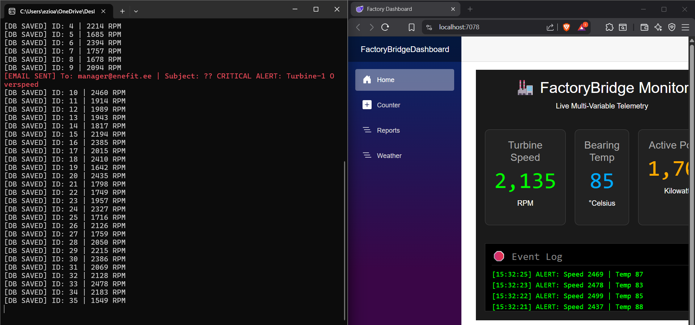

# FactoryBridge - Industrial IoT Middleware Suite

**FactoryBridge is an IIoT middleware suite built in .NET 10 that connects legacy Modbus PLCs to modern dashboards and storage. It includes a Modbus simulator (digital twin), a historian-backed real-time dashboard (Blazor Server + SQLite), alerting with cooldown logic, and a CLI client for validation. Designed to demonstrate integration patterns used in industrial OT environments.**

*(Above: The Simulator and Dashboard running simultaneously)*

## 🚀 Quick Start (One-Click Demo)
Want to see it run? You don't need to manually configure ports.
1.  **Clone the repo.**
2.  **Double-click `run_demo.bat`** (Windows).
3.  The script automatically launches the **Turbine Simulator** (Port 5020) and the **Web Dashboard** in the correct order.

## ▶️ Run Manually (Without `run_demo.bat`)

### 1) Run the Turbine Simulator (Modbus TCP Server)
From repo root:

powershell
cd LegacyMachine
dotnet run

## 🏗️ Architecture & Data Flow

FactoryBridge implements the "OT Triangle" pattern: **Simulator → Middleware → Historian/Dashboard**.

### Data Flow Lifecycle
1.  **Ingest:** The Background Orchestrator polls the `LegacyMachine` (Modbus Server) every 100ms for registers (RPM, Temperature, Power).
2.  **Process:** Raw bytes are converted to engineering units (Big-Endian float parsing).
3.  **Persist:** Valid readings are written to the `SQLite` Historian (with throttling to prevent IO locks).
4.  **Visualize:** The Blazor Server UI receives updates via event callbacks, refreshing the gauges in real-time.

5.  **Protect:** If `RPM > 2500`, the Alert Engine triggers an SMTP notification (with a 10-minute cooldown to prevent alarm fatigue).
